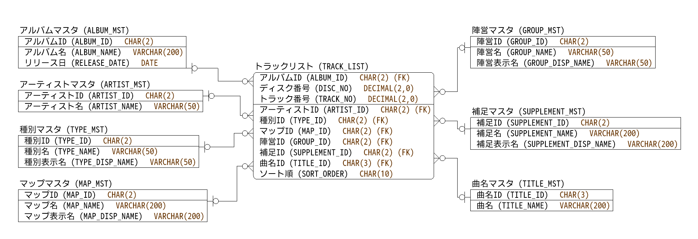

# BORDER BREAK Tracklist

BORDER BREAKのサントラCDの収録曲一覧とその曲がゲーム中のどのシーンで流れるかの補足情報を整理したtsvファイルです。  
下記サントラの収録曲を網羅しています。

* ボーダーブレイク サウンドトラック コンプリート CD-BOX
* BORDER BREAK MUSIC COLLECTION
* BORDER BREAK MUSIC COLLECTION TYPE-02
* BORDER BREAK MUSIC COLLECTION TYPE-03
* BORDER BREAK MUSIC COLLECTION TYPE-04
* BORDER BREAK MUSIC COLLECTION TYPE-05
* BORDER BREAK MUSIC COLLECTION TYPE-06

DB管理することを想定して正規化しています。想定しているER図は下記の通りです。

作者はmariadbにimportして管理しています。おまけとしてddlディレクトリにその際に使ったDDLも添付しておきます。